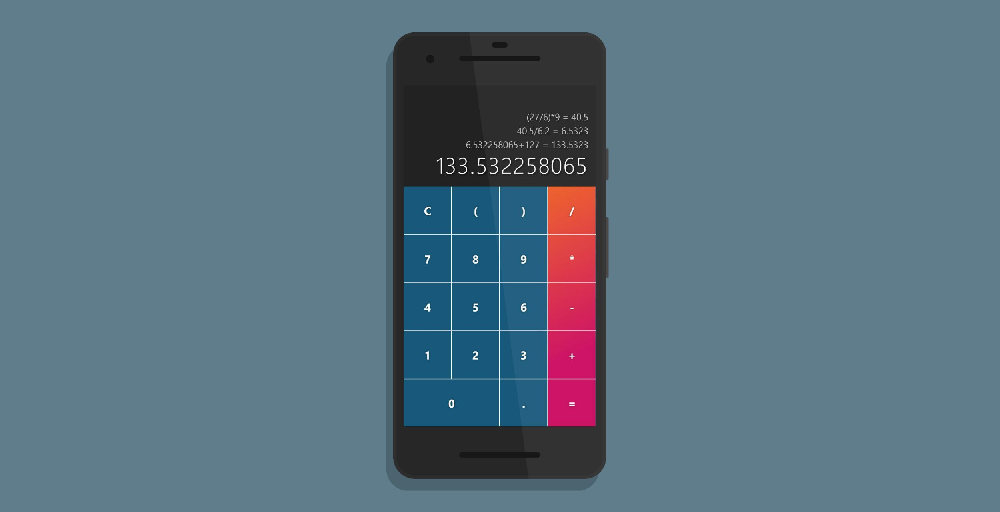

# BasicCalc - The super simple calculator PWA for mobile devices

[](https://travis-ci.com/adrianjost/Calculator-PWA)  [](https://dependabot.com) [](https://david-dm.org/adrianjost/Calculator-PWA) [](https://david-dm.org/adrianjost/Calculator-PWA?type=dev)

[](https://calculator.adrianjost.dev)

## Build Setup

```bash
# install dependencies
npm install

# serve with hot reload at localhost:8080
npm run dev

# build for production with minification
npm run build

# build for production and view the bundle analyzer report
npm run build --report
```

For detailed explanation on how things work, checkout the [guide](https://parceljs.org/).
